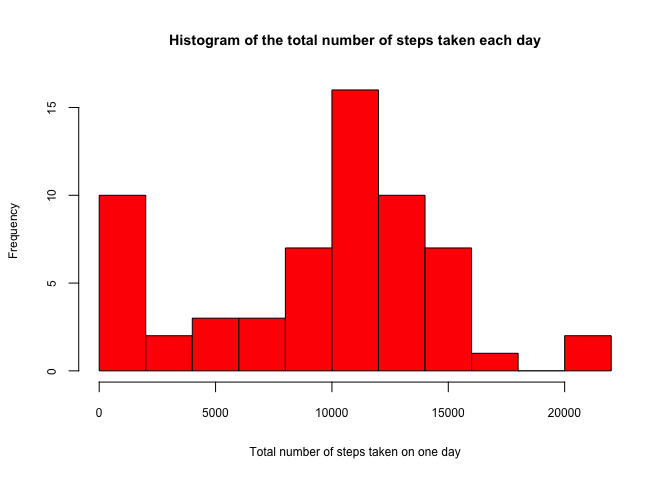
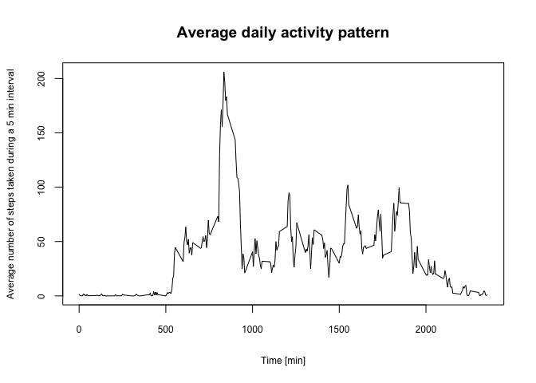

# Reproducible Research: Peer Assessment 1


## Loading and preprocessing the data
1. Load the data

```r
data <- read.csv(unz("activity.zip", "activity.csv"), nrows=17568, header=T, sep=",", 
                 colClasses = c("numeric", "Date", "numeric"))
```

2. Process/transform the data (if necessary) into a format suitable for your analysis

No processing or transformation of the data is necessary at this point.

## What is mean total number of steps taken per day?
For this part of the assignment, the missing values in the dataset are ignored.

1. Make a histogram of the total number of steps taken each day


```r
library(dplyr)
data_byDate <- group_by(data, date)
dataSummary_byDate <- summarize(data_byDate, stepsum_byDate = sum(steps, na.rm = TRUE))
hist(dataSummary_byDate$stepsum_byDate, 
     main = "Histogram of the total number of steps taken each day", # title
     xlab = "Total number of steps taken on one day", # x axis name
     cex.lab=0.75, cex.axis=0.75, cex.main=0.9, # text font
     breaks = 12, # Binning metric
     col = "red") # Histogram color
```

 

2. Calculate and report the mean and median total number of steps taken per day

The mean number of steps taken per day is:

```r
mean(dataSummary_byDate$stepsum_byDate, na.rm = TRUE)
```

```
## [1] 9354.23
```

The median number of steps taken per day is:

```r
median(dataSummary_byDate$stepsum_byDate, na.rm = TRUE)
```

```
## [1] 10395
```

## What is the average daily activity pattern?
1. Make a time series plot (i.e. type = "l") of the 5-minute interval (x-axis) and the average number of steps taken, averaged across all days (y-axis)


```r
data_byInterval <- group_by(data, interval)
dataSummary_byInterval <- summarize(data_byInterval, stepmean_byInterval = mean(steps, na.rm = TRUE))
plot(dataSummary_byInterval$interval, dataSummary_byInterval$stepmean_byInterval, # Data
     type="n", # Does not produce any points
     main = "Average daily activity pattern", # title
     xlab = "Time [min]", # x axis name
     ylab = "Average number of steps taken during a 5 min interval", # y axis name
     cex.lab=0.75, cex.axis=0.75, # text font
     )
lines(dataSummary_byInterval$interval, dataSummary_byInterval$stepmean_byInterval, type="l")
```

 

2. Which 5-minute interval, on average across all the days in the dataset, contains the maximum number of steps?
The 5-minutes interval containing the maximum number of steps is interval:

```r
dataSummary_byInterval$interval[which.max(dataSummary_byInterval$stepmean_byInterval)]
```

```
## [1] 835
```

## Imputing missing values
Note that there are a number of days/intervals where there are missing values (coded as NA). The presence of missing days may introduce bias into some
calculations or summaries of the data.
1. Calculate and report the total number of missing values in the dataset
(i.e. the total number of rows with NAs)

```r
sum( !is.na(data$steps) ) 
```

```
## [1] 15264
```
2. Devise a strategy for filling in all of the missing values in the dataset. The strategy does not need to be sophisticated. For example, you could use the mean/median for that day, or the mean for that 5-minute interval, etc.
3. Create a new dataset that is equal to the original dataset but with the missing data filled in.
4. Make a histogram of the total number of steps taken each day and Calculate and report the mean and median total number of steps taken per day. Do these values differ from the estimates from the first part of the assignment? What is the impact of imputing missing data on the estimates of the total daily number of steps?


## Are there differences in activity patterns between weekdays and weekends?
For this part the weekdays() function may be of some help here. Use the dataset with the filled-in missing values for this part.
1. Create a new factor variable in the dataset with two levels – “weekday” and “weekend” indicating whether a given date is a weekday or weekend day.
2. Make a panel plot containing a time series plot (i.e. type = "l") of the 5-minute interval (x-axis) and the average number of steps taken, averaged across all weekday days or weekend days (y-axis). The plot should look something like the following, which was creating using simulated data:
Your plot will look different from the one above because you will be using the activity monitor data. Note that the above plot was made using the lattice system but you can make the same version of the plot using any plotting system you choose.
